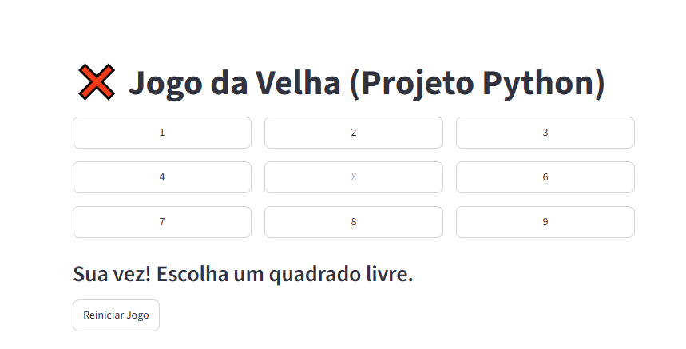

# ❌ Jogo da Velha (Python + Streamlit)

Este é um projeto interativo de Jogo da Velha desenvolvido em Python para o meu curso. A aplicação conta com uma interface web amigável e uma lógica inteligente onde o computador tenta bloquear as jogadas do usuário!

## 🎮 Como Jogar?
Você pode testar o jogo agora mesmo direto pelo seu navegador!
👉 **[Clique aqui para abrir o jogo rodando na Web](https://jogo-da-velha-python-ztzpzjvnvxccshna8af8z2.streamlit.app/)**

## 📸 Demonstração do Jogo
Aqui está uma prévia de como o jogo funciona:

